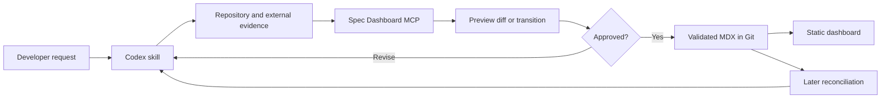

# Spec Dashboard user guide

Spec Dashboard turns repository evidence into a Git-tracked specification system and a static project dashboard. The recommended interface is the Codex plugin: users describe documentation work in natural language, focused skills investigate the project, and the project-scoped MCP server performs deterministic validation and preview-first writes.

This guide covers installation, initial setup, daily use, lifecycle management, reconciliation, review, and publishing. For lower-level details, see the [MCP reference](MCP_REFERENCE.md), [automation guide](AUTOMATION.md), and [troubleshooting guide](TROUBLESHOOTING.md).

## Mental model



The components have deliberately separate responsibilities:

| Component | Responsibility |
| --- | --- |
| Developer | Supplies intent, resolves ambiguity, and approves semantic changes |
| Codex skills | Inspect evidence and decide what documentation should say |
| MCP server | Query, validate, preview, write, transition, reconcile, and build |
| MDX content | Canonical, reviewable, Git-tracked project record |
| Static dashboard | Readable backlog, active work, knowledge, diagnostics, and relationships |
| CI | Rejects invalid documentation and publishes an up-to-date dashboard |

Spec Dashboard is not a passive documentation daemon. Skills activate when a user makes a matching request or names a skill explicitly. The MCP server does not independently watch the repository, import issues, or decide that work is shipped.

## Prerequisites

- Git repository containing the project to document.
- Node.js 22.12 or newer.
- npm 10 or newer.
- Codex with plugin support for the recommended workflow.
- Network access on the first MCP launch so `npx` can obtain the pinned Git release.

## Install the Codex plugin

Run these commands once:

```sh
codex plugin marketplace add olegtyshcneko/spec-dashboard --ref v0.8.0
codex plugin add spec-dashboard@spec-dashboard
```

Then open the target repository as the active Codex project. The bundled MCP command uses `--root .`; therefore the MCP process must start with the target repository as its working directory.

The release ref is intentionally explicit. Before upgrading, review the newer release notes and update the marketplace ref. Documentation on `main` can describe work newer than the currently pinned plugin release.

## Bootstrap a project

Start from the target repository root and ask:

> Use `$bootstrap-spec-dashboard` to inspect this project and create a reviewed dashboard baseline. Show the proposed category taxonomy and initialization preview before applying anything.

The bootstrap workflow will:

1. Inspect README files, architecture guidance, package manifests, entrypoints, tests, Git history, and existing plans.
2. Separate observed facts from inferred future work.
3. Propose a small, stable category taxonomy.
4. Preview `specdash.config.yaml` without writing it.
5. Ask for approval when the taxonomy was not already approved.
6. Initialize the project and allocate stable `SPEC-*` and `KB-*` identifiers.
7. Create baseline entries in reviewable batches.
8. Validate all content and build the static dashboard.

The initialized project contains:

```text
specdash.config.yaml
content/
  specs/
    *.mdx
  knowledge/
    *.mdx
dist/                 # generated; normally ignored by Git
```

The baseline should capture useful project boundaries, not inventory every file or TODO. Good initial content includes current capabilities, active work, important backlog, known bugs, architecture decisions, and operational knowledge.

## Review the first baseline

Every content write follows a two-stage protocol:

```text
specdash.preview_change
  → changeId + expectedRevision + diff
specdash.apply_change
  → applied revision or a safe rejection
```

Review proposed entries for:

- Unsupported claims or invented completion state.
- Duplicate scope.
- Categories that mirror temporary directory names rather than product boundaries.
- Missing acceptance criteria or source evidence.
- Incorrect dependencies and related knowledge.
- Untrusted content copied as executable MDX rather than plain Markdown.

An apply fails if the underlying file changed after preview. A write that makes the project invalid is rolled back.

## Daily workflow

### Find work

Ask Codex to query the canonical model rather than scan every file:

> Show ready P0 and P1 work in the platform category, including dependencies, blockers, owners, and next actions.

> Show work assigned to the next-release milestone, grouped by lifecycle state.

> What active items are unowned or missing a next action?

> Show the knowledge entries connected to `SPEC-014`.

### Capture new work

Use the capture skill for an idea, request, issue, plan, PR, or implementation:

> Use `$capture-spec-work` to capture issue #42 as a backlog specification. Inspect the issue and related code first, reuse an overlapping item if one already exists, and show the diff before writing.

The skill queries existing entries before allocating a new ID, distinguishes kind from lifecycle and priority, writes testable acceptance criteria, and attaches available evidence.

### Update existing work

> Update `SPEC-014` with the agreed non-goals and the new API test evidence. Preserve its ID and historical decisions.

> Record this blocker and set the next action to the smallest unblocking experiment.

Avoid adding contradictory append-only notes. Replace stale claims while retaining decisions that are still useful.

### Review quality

> Use `$review-spec-quality` to review all ready and active specifications. Report blockers first and do not edit anything.

The review combines deterministic validation with semantic critique. Review-only prompts do not authorize writes. When fixes are requested, they still use preview-first changes.

## Lifecycle management

Specification states are operational, not decorative:

| State | Meaning |
| --- | --- |
| `idea` | Worth retaining, but not yet shaped for planning |
| `backlog` | Accepted candidate work that is not ready to start |
| `ready` | Scoped, testable, and sufficiently unblocked |
| `active` | Owned work currently being executed |
| `blocked` | Active work that cannot progress until a named blocker changes |
| `review` | Implementation is awaiting verification or acceptance |
| `shipped` | Passed the project-specific release boundary with evidence |
| `archived` | Intentionally removed from the active planning system |

Use explicit transitions:

> Move `SPEC-014` to review and attach PR #87 as evidence. Preview the transition first.

The MCP enforces the allowed state machine. It does not mark an item shipped because code exists, a branch name matches, or a PR is open. Shipping should retain release or verification evidence.

## Plan delivery with milestones

Milestones answer which work belongs to a delivery. They do not replace lifecycle, priority, dependencies, or release evidence. Declare them in roadmap order in `specdash.config.yaml`:

```yaml
milestones:
  - id: next-release
    label: Next release
    description: Reviewed work selected for the next delivery.
    status: active
    startDate: 2026-07-15
    targetDate: 2026-08-15
  - id: previous-release
    label: Previous release
    status: completed
    startDate: 2026-06-01
    completedDate: 2026-07-01
```

`status` is `planned`, `active`, or `completed` and defaults to `planned`. `startDate` and `targetDate` are optional; a completed milestone requires `completedDate`. Every date uses `YYYY-MM-DD`, and completion/target dates cannot precede the start. Assign a specification with the configured ID:

```yaml
milestone: next-release
```

Unknown IDs, duplicate milestone declarations, and invalid milestone date/status combinations fail validation. The roadmap follows configuration order, includes every non-archived item assigned to a milestone, and separately surfaces open unscheduled work. Shipped work without a milestone does not clutter the unscheduled queue.

The roadmap puts scope controls before its content. It defaults to `Current`, while `All` and `Completed` reveal historical delivery in one click. Milestone, work-state, time-range, and search filters apply to both the graphical vertical timeline and compact list; filters and view choice are retained in the URL. Time-range windows (last 30/90 days, last year, next 90 days, this year) match milestones by date-interval overlap, so an in-flight milestone appears in both past and future windows; undated milestones match only `All time`.

After the configuration is reviewed in Git, use the capture workflow to assign work:

> Add SPEC-014 to the configured next-release milestone. Preserve its lifecycle and priority, and preview the content change before applying it.

## Reconcile after implementation changes

Reconciliation compares declared file evidence with Git history and working-tree changes:

> Use `$reconcile-spec-dashboard` to reconcile documentation against changes since `origin/main`. Report suggestions with evidence and confidence before changing anything.

The deterministic reconciler can identify:

- Referenced implementation paths changed since a Git boundary.
- Source paths that no longer exist.
- Implementation commits newer than the referring documentation.
- Reviewable lifecycle candidates.

The skill supplements those findings with tests, issues, PRs, releases, and connected external systems. Suggestions are evidence for review, not automatic semantic truth.

## Build and view the dashboard

Ask Codex:

> Validate and build the dashboard. Do not report success if diagnostics contain errors or the build fails.

Or use the tagged CLI directly:

```sh
npx --yes --package=github:olegtyshcneko/spec-dashboard#v0.8.0 \
  specdash validate --root .

npx --yes --package=github:olegtyshcneko/spec-dashboard#v0.8.0 \
  specdash build --root .
```

The build produces static HTML, CSS, JavaScript, and JSON in the configured output directory. Serve the output over HTTP; do not rely on opening `dist/index.html` through `file://`, because absolute asset paths and browser security behavior vary.

For local development from a source checkout:

```sh
npm install
npm run dev
```

For CI and GitHub Pages, follow [AUTOMATION.md](AUTOMATION.md).

## Dashboard navigation

The generated dashboard provides:

- Counts and filters for active, blocked, ready, backlog, review, and shipped work.
- Search and URL-backed filters by ID, title, summary, milestone, category, owner, or tag.
- Checklist progress derived from Markdown.
- A filter-first roadmap with Current/All/Completed scope, milestone/work-state/time-range/search filters, and switchable vertical timeline/list views.
- Global full-text search from every page: `/` or `Ctrl+K` opens a dialog that ranks specs and knowledge by title, summary, id, tags, and body text, with highlighted snippets.
- Health diagnostics for invalid, stale, or operationally incomplete entries.
- Knowledge pages connected to specifications by generated backlinks.
- A relationship Map/List switcher with category, lifecycle, and neighborhood scoping.

When a project exceeds 80 graph nodes, the relationship page defaults to List view. Users can choose a category, lifecycle state, or focused node before switching to the graphical map.

## Suggested team routine

1. Capture work during planning rather than after implementation is complete.
2. Move only well-scoped items to `ready`.
3. Assign an owner and next action when work becomes `active`.
4. Record blockers when progress stops.
5. Review specification quality alongside code review.
6. Reconcile after merges and before releases.
7. Mark work shipped only with project-specific evidence.
8. Validate and publish the dashboard from CI.

## External systems

The Spec Dashboard MCP owns the local canonical store and renderer. It does not store credentials for GitHub, Linear, Jira, Slack, or documentation systems. Codex should use the appropriate connected tool for external evidence and save durable references into `sourceRefs`.

## Update or remove the integration

To update, install a newer reviewed marketplace ref and plugin version. Ensure the plugin manifest and `.mcp.json` point to the same release.

To stop using the system, remove or disable the plugin through Codex. The repository content remains ordinary YAML and MDX in Git; no hosted service owns it.
